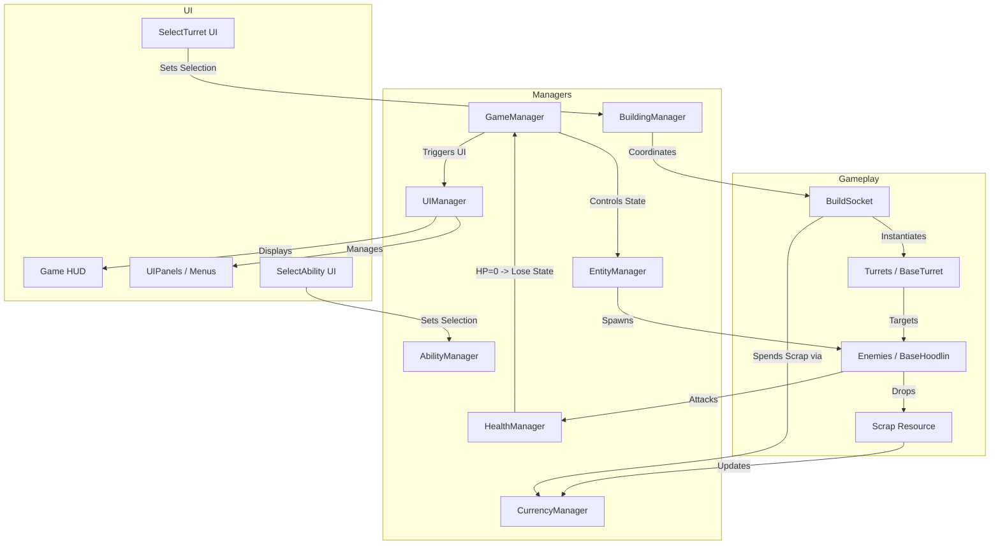

# Project Map (Mermaid Chart) - HM Lockdown

**Version:** 1.0.0  
**Created:** 2026-05-27  
**Last Updated:** 2026-05-27  

This document provides a visual representation of the project architecture and the relationships between key systems.

---

## System Dependency Diagram

---

## Pattern Notes
*   **Centralization:** All arrows pointing to Managers represent a `Singleton.Instance` call.
*   **Event-Driven:** Game state transitions in the `GameManager` trigger reactions in other managers to avoid tight coupling where possible.
*   **Entity Logic:** Enemies are autonomous but rely on global managers (`HealthManager`, `CurrencyManager`) to report their impact on the game world.
